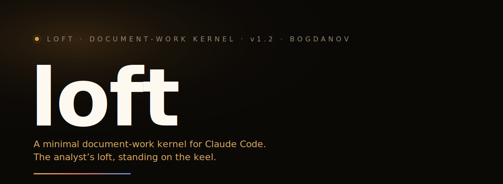

<p align="center">
  
</p>

<p align="center">
  
  
  
  
  
  
</p>

<p align="center">
  <b>English</b> · <a href="README.ru.md">Русский</a>
</p>

---

**Loft** is a minimal, load-bearing kernel for [Claude Code](https://claude.com/claude-code)
document work. It makes the agent a working systems/business analyst — writing
specs, maintaining a wiki mirrored from Confluence, auditing a documentation
corpus — and adds nothing else.

A loft is the top floor resting on load-bearing beams — and this one stands on
a keel: [Keel](https://github.com/bogdanov-igor/keel) is the sibling kernel by
the same author for product development. Same philosophy, different profession.

Loft is the successor to **specos**, buried in June 2026 after diagnosing why a
capable setup kept "getting dumber" on plain markdown work. The verdict, in one
line: **the overhead ate the context.** Two MCP servers that markdown work never
needed cost ~20–30k tokens of schemas on every session *and every subagent*;
per-task ceremony pumped the dialog full of tool output until early auto-compact
cut it away — which looked exactly like amnesia. Loft keeps one ~3k-token
contract always on — roughly 8–10× less — and zero MCP servers, vector indexes
or daemons of its own.

→ [**What changed, measured**](docs/en/why-loft.md) — the full diagnosis, cause
by cause, and what loft does against each.

## Quickstart

**1.** Download `loft_1.1.0.tgz` and `loft_1.1.0.tgz.sha256` from
[Releases](https://github.com/bogdanov-igor/loft/releases/latest) into your
project folder.

**2.** Open the project in Claude Code and say:

> Install loft from the archive in this folder: verify the sha256, unpack it,
> run `loft/install.sh`, then tell me what it set up.

**3.** If the project ran specos before, say:

> Clean up the specos leftovers and propose the re-audit.

That is the whole installation. Claude verifies the checksum, unpacks, installs,
and reports; the cleanup step quarantines the predecessor's machinery (deleting
nothing) — see the [migration guide](docs/en/migration.md).

### Or do it yourself

```sh
cd /path/to/project                    # tgz + .sha256 copied here
shasum -c loft_1.1.0.tgz.sha256        # integrity first: expect "OK"
tar -xzf loft_1.1.0.tgz
bash loft/install.sh                   # no argument = install right here
```

From the source repo instead: `bash install.sh /path/to/project`.

**Updating is the same command.** Get the newer loft, re-run `install.sh`:
kernel files are replaced, project state is never touched, and skills or agents
you added yourself are carried over. A `SessionStart` hook prints one line when
a newer loft exists — next to the project (a `loft/` folder or `$LOFT_HOME`)
or in [Releases](https://github.com/bogdanov-igor/loft/releases) (cached 24h,
3s ceiling) — silence is the default path, any failure exits quietly.

Dependencies: `python3` (all kernel scripts are stdlib); `pandoc` + `lxml`
only for the `ingest-*` skills.

## What it is

- **One always-on contract** — [`.claude/CLAUDE.md`](bundle/.claude/CLAUDE.md),
  81 lines, ~3k tokens. It states the profession and the pointers; procedures
  live in skills and load only when used. The profession's core rule, verbatim
  in the contract: **not a single invented fact** — every claim is either
  derivable from a source or explicitly marked as an assumption or a question.
- **14 lazy-loaded skills** — spec work (`tz-write`, `tz-adapt`, `tz-audit`,
  `tz-elicit` with question banks for 6 task types), corpus work
  (`ingest-confluence`, `ingest-docs`, `review-intake`, `link-check`, `knowledge-map`), and process
  (`spec-bootstrap`, `deliver-pdf`, `remember`, `stage`, `migrate-specos`).
- **2 subagents** — `scout` (reads big page batches so the main window stays
  clean) and `verifier` (independent acceptance of documents with a fresh
  context). Decomposed by context isolation, not by job title.
- **2 hooks** — `leak-guard` (secrets and internal addresses never land in
  docs) and a silent update check.
- **File memory** — `memory/` notes with a strict one-line index, plus
  `BACKLOG.md` as the single work queue and `QUESTIONS.md` for open stakeholder
  questions, each with a plan for how work resumes after the answer.

**Done is a verdict, not a self-report.** A document counts as finished when
the `verifier` agent — fresh context, no stake in the draft — confirms it on
five axes: fidelity to the request, substantiation of claims, link integrity,
structural completeness, internal consistency.

## What it deliberately does not have

- **No MCP servers by default, no vectors, no embeddings, no Ollama.** A corpus
  of a few hundred markdown pages is found by reading an index and grepping.
  The predecessor's unconditional serena + playwright in `.mcp.json` cost
  ~20–30k tokens of schemas per session and per subagent — dead weight for
  markdown work; and when its local embedding daemon was down, degraded search
  looked like amnesia.
- **No per-task ceremony.** No runs log, no schema validation, no 9-gate verify
  on every touch. Small work (one page, low risk) produces zero process files;
  big work (a full spec, a corpus audit, a restructuring) produces exactly two —
  `stages/NNN-slug/brief.md` before and a verified `report.md` after.
- **No patches of other people's extensions.** Diagrams are the consumer
  renderer's job — a `mermaid` fence renders wherever the corpus is read.

The boundary rule, from the roadmap: a script in the kernel may only be a
**deterministic data converter** (input → output). Checks of *meaning* are
instructions to agents in skills. Features with state, history or UI live
outside the kernel.

## The Confluence converter

The flagship: skill `ingest-confluence` turns a Confluence HTML space export
into a markdown wiki with `[[wikilinks]]` — **deterministically** (pandoc +
lxml). No LLM rewrites a single fact in transit.

- Its own HTML→GFM table writer; tables that cannot survive the trip are left
  as HTML and **logged with a reason**, never silently mangled.
- Attachment link names are restored from the export's
  `data-linked-resource-default-alias` — no more `download.xhtml?...` link text.
- Re-ingest updates the snapshot: stale pages are removed (files without a
  `confluence_id` are untouchable), and you get a change report —
  `wiki/_CHANGES-<date>.md` for you, `wiki/.ingest.json` for machines.
- `--space` and `--base-url` generalize it to any space; the snapshot date is
  read from the export itself. An idempotent postprocessor (`fix_tables.py`)
  upgrades wikis converted by v1 in place.
- Optional `--unroll-pre`: tables holding multi-line JSON/XML examples become
  clean GFM, with the code moved below the table as fenced blocks — byte-exact.

Proven on a real banking corpus of **446 pages**: 468 of 609 raw HTML tables
converted to clean GFM (the remainder are logged fallbacks, almost all
multi-line JSON examples), **0 empty links**, a 336-page tree byte-identical
to the reference conversion, and **0 broken links out of 3,645** after
`link-check`.

## The corpus is a graph

`[[wikilinks]]` resolved by basename, `![[embeds]]`, `\|`-escaped aliases in
tables — the corpus speaks the Foam/Obsidian dialect on purpose. Open the
project folder in [Obsidian](https://obsidian.md), or install
[Foam](https://foambubble.github.io/foam/) in VS Code (the installer seeds the
extension recommendation), and the graph view, backlinks and link navigation
work out of the box — a property of the file format, not a feature of the
kernel. `link-check` resolves links the same way the graph tools do (basename,
case-insensitive, NFC), so a green `link-check` means a graph without holes.

## Tested

`test/run.sh` holds the kernel's scripts to account: 40+ self-tests — plain
assertions over `link_check`, the table writer, `fix_tables` idempotence, the
migration sweep, the update check and installer scenarios — run offline against
throwaway fixtures. `build-archive.sh` runs them as a release gate and then
self-tests a real install from the freshly built archive; a kernel that fails
its own checks never ships. The 0.1.0 release also passed an independent
verification: 20/20 findings closed, the 3 critical ones in code inherited from
the v1 converter.

## Layout in a deployed project

```text
.claude/      kernel (kernel-owned: reinstalling overwrites it)
wiki/         Confluence mirror — generated, never edited by hand
spec/         authored specs and decisions + _STRUCTURE.md (structure profile)
inbox/        incoming files before conversion; originals are kept
memory/       project memory: MEMORY.md index + lessons/antipatterns/patterns/structures
stages/       big-work artifacts: NNN-slug/brief.md + report.md
BACKLOG.md    the one canonical work queue
QUESTIONS.md  open stakeholder questions, each with a resume plan
```

## Coming from specos?

Install loft, then run the **`migrate-specos`** skill. It quarantines the
predecessor's machinery — bundles, distributions, engine state — into a
timestamped `.loft-migration/` folder with a restore manifest, **never deletes
anything**, and never touches project state: wiki, specs, memory, backlog. The
installer already refuses to carry the MCP tax over — a specos-era `.mcp.json`
goes to backup, not into your next session.

→ [Migration guide](docs/en/migration.md)

## Documentation

| | English | Русский |
|---|---|---|
| Install & update | [install](docs/en/install.md) | [установка](docs/ru/install.md) |
| Architecture | [architecture](docs/en/architecture.md) | [архитектура](docs/ru/architecture.md) |
| Migrating from specos | [migration](docs/en/migration.md) | [миграция](docs/ru/migration.md) |
| What changed, measured | [why-loft](docs/en/why-loft.md) | [почему loft](docs/ru/why-loft.md) |

## Licence

[Apache-2.0](LICENSE) © 2026 **Igor Bogdanov** · <bogdanov.ig.alex@gmail.com>

Free to use, fork and build on — commercially included. Keep the attribution
and state what you changed.
