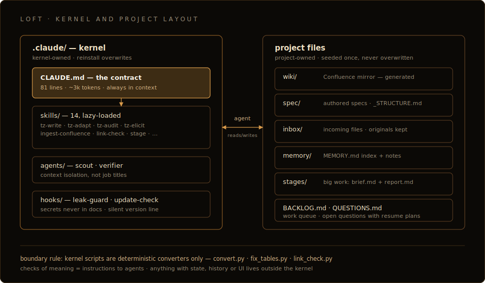
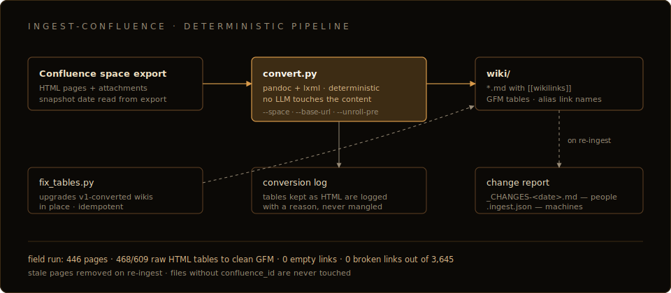

# Architecture

Loft is built on one idea: files are the only shared truth, and the agent is
a co-author analyst. Everything below follows from that.



## The contract

[`.claude/CLAUDE.md`](../../bundle/.claude/CLAUDE.md) — 81 lines, ~3k tokens,
always in context, and the only thing that always is. It fixes two things.

The profession. The agent is the project's systems/business analyst on the
owner's side: it writes specs (whole or in parts), analyzes and audits other
people's documents, bootstraps the structure of new projects. The owner sets
direction and answers questions; wording, completeness, coherence and
substantiation are the agent's job. The core rule — no invented facts: every
claim is either derivable from a source or explicitly marked as an assumption
or a question.

Ten working rules. Two tiers of work; memory before non-trivial work and
`remember` after a non-obvious lesson; spec writing goes through `tz-write` /
`tz-adapt` / `spec-bootstrap` and incomplete requests through `tz-elicit`;
"done" requires a `verifier` verdict; audits file findings into `BACKLOG.md`;
facts are cited by `[[wikilink]]` rather than retold; incoming files only
through `inbox/`; secrets never in docs; subagents exist for context
isolation, not roles; sessions start from `QUESTIONS.md` and the top of
`BACKLOG.md`.

The rest of the kernel is pointers. Procedures live in skills and enter
context only when used.

## The files

```text
wiki/         generated Confluence mirror — never edited by hand;
              meaning changes go to Confluence or to spec/
spec/         authored documents: specs, decisions, glossary,
              _STRUCTURE.md (the project's spec-structure profile)
inbox/        incoming docx/pdf/images/html before conversion; originals kept
memory/       lessons · antipatterns · patterns · structure profiles,
              indexed by MEMORY.md (strict one-liners)
stages/       NNN-slug/brief.md + report.md — big work only
BACKLOG.md    the one canonical work queue: tasks and audit findings
QUESTIONS.md  open questions to owner and stakeholders,
              each with a plan for how work resumes after the answer
```

Any conclusion worth keeping past the session gets written down the moment it
exists — whatever stays only in the context window is gone when the window
is.

Memory is markdown notes plus a strict one-line index. Retrieval is reading
the index and grepping; there is no embedding model, no vector store, no
daemon. See [why-loft](why-loft.md) for what happened when there was one.

`QUESTIONS.md` plays the role of a parking lot. A critical question without
an answer blocks a spec, so it is filed together with a plan for continuing,
instead of stalling the work silently. At session start, answered questions
return their work to `BACKLOG.md`.

## Two tiers of work

| | Small | Big |
|---|---|---|
| **What** | One page, low risk | Full spec, corpus audit, restructuring, multi-session work |
| **Protocol** | Do it, check it, move on | Skill `stage` |
| **Artifacts** | None | `stages/NNN-slug/brief.md` before, verified `report.md` after |

That's all the process there is. The predecessor ran the same run-log →
schema-validation → multi-gate pipeline for a one-line fix as for a full
spec, and paid for it in context.

## Skills

14 markdown procedures under `.claude/skills/`, lazy-loaded: a skill costs
nothing until it is used.

Spec work:

- `tz-write` — write a spec or a section in the project's structure. Every
  claim carries a source link or an explicit assumption marker; acceptance is
  the `verifier`'s verdict.
- `tz-adapt` — learn a foreign spec structure from samples, fix the profile
  in `memory/structures/`, then write in it via `tz-write`. For customer
  documents and other people's projects.
- `tz-audit` — audit a document or corpus along six axes: completeness
  against the structure profile, contradictions (including name synonyms for
  one system, checked against the glossary), link integrity via `link-check`,
  substantiation, staleness, hygiene. Produces a traffic-light report;
  findings go to `BACKLOG.md`. A corpus audit is a stage.
- `tz-elicit` — turn an incomplete request into a working brief. `banks.md`
  carries question banks for six task types (integration, migration, UI/UX,
  functionality, bug, general). Questions go in one batch; critical ones left
  unanswered go to `QUESTIONS.md`, the rest become marked assumptions.

Corpus work:

- `ingest-confluence` — the deterministic Confluence converter (below).
- `ingest-docs` — incoming docx/pdf/images/html → markdown through `inbox/`.
  The original is kept and linked from the conversion; docx converts
  deterministically via pandoc; pdf and images become a synopsis with a
  mandatory marker and a link to the original.
- `link-check` — `link_check.py` (stdlib, deterministic): broken
  `[[wikilinks]]`, `![[embeds]]`, relative markdown links and images, orphan
  pages. Resolution is Foam/Obsidian-style by basename, NFC-normalized and
  case-folded; lines inside code fences are skipped. Exits 1 on breakage, so
  it can sit in a pipeline.

Process:

- `spec-bootstrap` — stand up a new project's documentation: corpus layout,
  spec-structure profile, glossary, decision register. The structure is
  agreed with the owner before any mass writing.
- `remember` — write a lesson, antipattern, pattern or structure profile to
  project memory, with a one-line index entry.
- `stage` — the big-work protocol: brief before, verified report after.
- `migrate-specos` — quarantine the predecessor's machinery with a rollback
  manifest; see [migration](migration.md).

Skills you write yourself live alongside these and survive kernel reinstalls
automatically.

## The Confluence converter

The converter is why the boundary rule exists. `ingest-confluence` turns a
Confluence HTML space export into a markdown wiki with `[[wikilinks]]`,
deterministically, with pandoc + lxml. No LLM rewrites a fact in transit —
which is what makes the output checkable.



- Own HTML→GFM table writer. A table that cannot survive the trip stays as
  HTML and is logged with a reason, never silently mangled.
- Attachment link names are restored from the export's
  `data-linked-resource-default-alias` attribute, so links read as file
  names, not `download.xhtml?...`.
- Re-ingest updates the snapshot. Stale pages are removed on re-conversion;
  files without a `confluence_id` in front-matter are untouchable, so
  hand-written pages inside `wiki/` are safe. Since 1.0.0 a re-ingest also
  produces a change report: `wiki/_CHANGES-<date>.md` for people,
  `wiki/.ingest.json` for machines.
- `--space` sets the space key, `--base-url` the Confluence address for
  source links; the snapshot date is read from the export itself.
- `fix_tables.py` is an idempotent postprocessor that upgrades wikis
  converted by v1 (HTML tables → GFM, attachment link names) in place.

Field results, from a real banking corpus of 446 pages: 468 of 609 raw HTML
tables converted to clean GFM (the remainder are logged fallbacks, almost all
multi-line JSON examples), 0 empty links, a 336-page tree byte-identical to
the reference conversion, 0 broken links out of 3,645.

## The boundary rule

This is what keeps the kernel from growing back into its predecessor:

- A script in the kernel may only be a deterministic data converter
  (input → output): `convert.py`, `fix_tables.py`, `link_check.py`. That is
  the complete list.
- Checks of meaning — terminology, completeness, sanitation, tracing — are
  instructions to agents in skills. The agent reads the skill and does the
  check itself, with eyes and grep.
- Features with state, history or UI (git/diff/versioning, a graph screen, a
  kanban) live outside the kernel. No embeddings, vectors, own MCP, daemons
  or schedules.

## Subagents

Two, and the split is about context isolation, not job titles:

- `scout` reads the corpus and external sources so the main window doesn't
  have to. Big page batches are read by parallel scouts, not the main thread.
- `verifier` independently accepts documents in a fresh context, along five
  axes: fidelity to the request, substantiation, link integrity, structure,
  consistency.

## Hooks

Two:

- `leak-guard.sh` — secrets and internal addresses (IPs, hosts, accounts,
  tokens) never land in docs. Values go to `.secrets.env`; documents carry
  `{{secret:KEY}}` or a `{SYSTEM_NAME}` placeholder. The hook blocks the
  violating write.
- `update-check.sh` (`SessionStart`) — one line when a newer loft sits next
  to the project (a `loft/` folder or `$LOFT_HOME`); silence otherwise. No
  network calls; any failure exits quietly and never blocks a session.

## Testing the kernel

The kernel is scripts, and unexercised scripts rot. `test/run.sh` drives the
shipped scripts against throwaway fixtures in a temp directory, offline: 48
assertions over `link_check`, the table writer, `fix_tables` idempotence, the
migration `sweep.sh`, `update-check.sh` and installer scenarios. Each case is
either a real bug caught by hand (some during the independent review) or a
property the documentation promises.

`build-archive.sh` runs the suite first and refuses to build if anything
fails, then unpacks the archive it just built into a temp directory and
performs a real install to verify it. The installer itself ends with a
self-check — contract present, hooks executable, skill count, `link_check`
runs — and fails loudly rather than hand over a broken kernel.

## What is kernel-owned vs project-owned

```text
.claude/     kernel-owned — reinstalling overwrites it. Never edit in place.
everything   project-owned — the installer seeds it once where absent and
else         never touches it again.
```

Kernel changes happen in the loft repo and reach projects by reinstall. If
you edit `.claude/` inside a deployed project, the change dies at the next
update.
