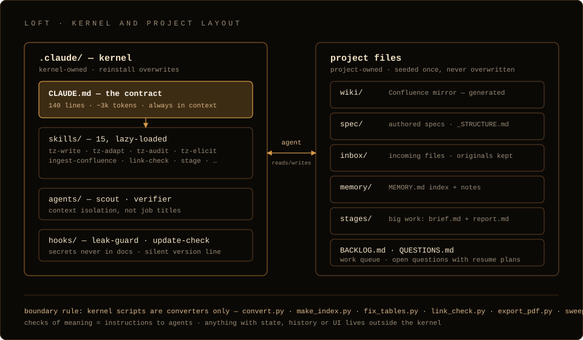
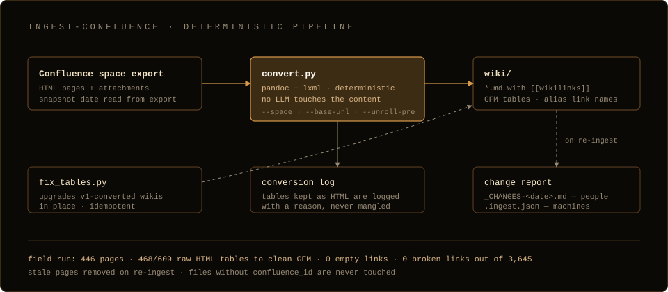

# Architecture

Loft rests on one idea: files are the only shared truth, and the agent is a
co-author analyst. Everything else follows from that.



## The contract

[`.claude/CLAUDE.md`](../../bundle/.claude/CLAUDE.md) — 173 lines, ~3k
tokens, always in context and the only thing that always is. It fixes three
things.

The profession. The agent is the project's systems/business analyst on the
owner's side: it writes specs whole and in parts, audits other people's
documents, bootstraps the structure of new projects. The owner keeps the
forks that are his — money, scope, risks, external unknowns; wording,
completeness, coherence and substantiation are the agent's job. A technical
question the corpus and domain knowledge can answer, the agent closes itself:
a recommendation, the reasoning, a way to check. The owner came for help, not
for a list of questions. The core rule — not one invented fact: every claim
is either derived from a source or named as an assumption in the passport.

The reader. The document is read by a person who has opened no other files
and is going to act on it — the next section.

The working rules. Five of them open into sections below: the two tiers of
work, `verifier` on stages and delivery, secrets, subagents, tests. The rest:
memory before non-trivial work and `remember` after a non-obvious lesson;
specs and audits each go through their own skill; a technical question is
closed with an answer, not another question; "read" means "the file was
opened in full"; `link-check` runs after a batch of page edits; a session
starts from `QUESTIONS.md` and the top of `BACKLOG.md`. The rest of the
kernel is pointers.

## Who we write for

Documents used to be written, quietly, for acceptance — "decision of 12.08"
markers, "(Assumption)" tags, "see section 4" footnotes. All of that is
addressed to a judge, while the person actually reading has opened no other
files and is going to act on the document. The clean copy is written for him:
connected prose, short rules shaped "input → case a: action → case b:
action", a fact stated once with a link standing in for the repeat, a
`[[wikilink]]` on the term itself instead of a "see also". A list of items
with attributes is a table; a sequence or a set of states is `mermaid`.

Everything procedural lives in the **document passport** — the frontmatter:

| Field | What goes in it |
|---|---|
| `status` | draft / review / approved — what leaves the corpus is review or approved |
| `source` | the request the document grew out of |
| `based_on` | files read in full; the claims are derived from them |
| `assumptions` | what was taken without confirmation, and what would confirm it |
| `decisions` | links to entries in `spec/решения.md` |
| `questions` | Q-N from `QUESTIONS.md` |

`verifier` checks the document against its passport: does `based_on` cover
the claims, is an assumption hiding in the text as a fact. Traces of the
procedural left in the clean copy are a defect to it, not a formatting nit.

The project's voice comes from the "Voice" section of `spec/_STRUCTURE.md` —
sample paragraphs verbatim, not a description of a style; phrasing templates
and the self-check for waffle are in `tz-elicit/templates.md`.

## The files

```text
wiki/         generated Confluence mirror — never edited by hand;
              meaning changes go to Confluence or to spec/
spec/         authored documents: specs, glossary, решения.md, the
              _STRUCTURE.md profile (structure and voice), source
              samples in _reference/, review decisions in _reviews/
inbox/        new material only; a processed original moves to inbox/done/
memory/       lessons · antipatterns · patterns · structure profiles,
              indexed by MEMORY.md (strict one-liners)
stages/       NNN-slug/brief.md + report.md — big work only
BACKLOG.md    the one canonical work queue: tasks and audit findings
QUESTIONS.md  open questions, each with a plan for resuming after the answer
```

What isn't written down dies with the context window, so a conclusion that
has to outlive the session goes into a file the moment it exists.
`inbox/done/` is the same thought: what has been read and folded in is
visible from the file system, not from the agent's memory, which won't live
to the next session.

Memory is markdown notes plus a strict one-line index; retrieval is reading
the index and grepping. Claude Code's auto-memory is off in `settings.json`
(`autoMemoryEnabled: false`): two memories drift apart quietly, and then
there's no telling which one is right. What it was like when retrieval ran on
a daemon is in [why-loft](why-loft.md).

`QUESTIONS.md` is the parking lot: a critical question without an answer
blocks a spec, so it is filed with a plan for continuing instead of stalling
the work silently. At session start, answered questions return their tasks to
`BACKLOG.md`.

## Two tiers of work

| | Small | Big |
|---|---|---|
| **What** | One page, low risk | Full spec, corpus audit, restructuring, multi-session work |
| **Protocol** | Do it, check it, move on | Skill `stage` |
| **Artifacts** | None | `stages/NNN-slug/brief.md` before, verified `report.md` after |
| **Acceptance** | The author himself | A `verifier` verdict against the brief's criteria |

That's all the process there is. The predecessor ran one pipeline — run log,
schema validation, multi-gate verify — for a one-line fix and for a full spec
alike, and paid for it in context.

## Skills

15 markdown procedures under `.claude/skills/`, lazy-loaded: a skill costs
nothing until it is used. One line each here; the procedure itself lives
inside the skill.

Spec work:

- `tz-write` — write a spec or a section in the project's structure and
  voice.
- `tz-adapt` — take the profile of a foreign structure off samples in
  `spec/_reference/`, park it in `memory/structures/`, then write in it.
- `tz-elicit` — turn an incomplete request into a brief: question banks for
  six task types, phrasing templates, the self-check for waffle.
- `tz-audit` — an audit along seven axes, a document × axis table with
  traffic lights, findings in `BACKLOG.md` with `path:line` evidence.
- `spec-bootstrap` — the layout, structure profile, glossary and decision
  register of a new project.

Corpus work:

- `ingest-confluence` — the deterministic Confluence converter, below.
- `ingest-docs` — docx/pdf/images/html from `inbox/` into the corpus: docx
  via pandoc, pdf and images as a synopsis linking back to the original.
- `link-check` — `link_check.py`: broken `[[wikilinks]]`, `![[embeds]]`,
  relative links, anchors that land nowhere, orphans. Foam/Obsidian-style
  resolution, exit 1 on findings — fit for a pipeline.
- `knowledge-map` — the corpus map `wiki/_KNOWLEDGE-MAP.md`: a line per page,
  synthesized by parallel `scout`s. A page with no line in the map does not
  exist as far as `scout` is concerned, which is why the map covers the
  corpus whole.
- `review-intake` — a customer's return: an edited docx with track changes
  (`pandoc --track-changes=all`, since an ordinary conversion loses them
  silently) → an accept/reject/question table in `spec/_reviews/`.

Process and delivery:

- `stage` — a brief with readiness criteria and a premortem before the work,
  a verified report after.
- `remember` — a lesson, antipattern, pattern or profile into project memory,
  with a one-line index entry.
- `deliver-pdf` — `export_pdf.py` resolves wikilinks and bakes a PDF through
  a chain of engines (typst → weasyprint → wkhtmltopdf → Chrome headless →
  standalone HTML); `--md` / `--bundle` build the `.md` bundle for NotebookLM.
- `claude-docs` — publishing as a claude.ai page, on the owner's direct
  command only (`disable-model-invocation`).
- `migrate-specos` — quarantining the predecessor's machinery with a rollback
  manifest, see [migration](migration.md).

## The Confluence converter

The converter is why the boundary rule exists. `ingest-confluence` turns a
Confluence HTML space export into a markdown wiki with `[[wikilinks]]` using
pandoc + lxml. No LLM rewrites a fact in transit — which is what makes the
output checkable.



- Its own HTML→GFM table writer. A table that cannot survive the trip stays
  as HTML and is logged with a reason — nothing is mangled silently.
- Attachment link names are restored from the
  `data-linked-resource-default-alias` attribute, so links read as file
  names, not `download.xhtml?...`.
- Re-ingest updates the snapshot. Stale pages are removed, files without a
  `confluence_id` in front matter are never touched — hand-written pages
  inside `wiki/` are safe. Removing many pages at once is blocked until you
  say `--allow-mass-removal`: that is usually the sign of an incomplete
  export rather than a cleanup in Confluence.
- The converter reports its own changes: `wiki/_CHANGES-<date>.md` for
  people, `wiki/.ingest.json` for machines. The same file keeps the flags and
  the converter version, so a change of flags doesn't read as an edit to
  hundreds of pages.
- `fix_tables.py` is an idempotent postprocessor: it upgrades wikis converted
  by v1 in place.

Field results — 336 pages of a real banking corpus, 468 of 609 raw HTML
tables in clean GFM, 0 broken links out of 3,645 — with the breakdown in
[why-loft](why-loft.md).

## The boundary rule

What keeps the kernel from growing back into its predecessor:

- A script in the kernel may only be a deterministic data converter
  (input → output): `convert.py` (with `tablemd.py` inside it, shared with
  `fix_tables.py`), `make_index.py`, `fix_tables.py`, `link_check.py`,
  `export_pdf.py`, `sweep.sh`. That is the complete list.
- Checks of meaning — terminology, completeness, sanitation, tracing, voice —
  are instructions to agents in skills. The agent reads the skill and does
  the check itself, with eyes and grep.
- Features with state, history or UI (git/diff/versioning, a graph screen, a
  kanban) live outside the kernel. No embeddings, vectors, own MCP, daemons
  or schedules.

What replaces vector search is a corpus map plus reading a domain whole:
`knowledge-map` says where the answer lies, `scout` reads that domain on
Sonnet with a 1M window and comes back with quotes and paths. A chunk without
its context and caveats costs a spec more than the extra reading does.

## Subagents

Two, and the split is about context isolation, not job titles:

- `scout` (`model: sonnet`, writing forbidden) reads the corpus and external
  sources so the main window doesn't have to. It starts from the corpus map
  rather than grepping three hundred pages; a page it is named, it reads in
  full, a long one from an `offset` to the end. It returns `path:line` facts
  and splits what it read into "Opened in full" and "In fragments" — the
  first list is what `based_on` rests on.
- `verifier` (`model: opus`) judges a document independently, in a fresh
  context — on a stage and on delivery outside the corpus. The axes in order:
  the reader, the readiness criteria from the brief, fidelity to the request,
  substantiation via the passport, link integrity, structure, consistency.
  The output is a verdict scored `N pass / M fail / K unverifiable`, a
  findings table with severity and a "remove this" list. It fixes nothing;
  there are two rounds, and after the second the work ships with caveats.

## Hooks

Two:

- `leak-guard.sh` (`PreToolUse` on `Write|Edit|NotebookEdit`) blocks a write
  whose new text carries a value from `.secrets.env` of 6 characters or more
  — JSON-escaped spellings included, since the hook's payload arrives as
  JSON. It looks only at the text being written (`content`, `new_string`,
  `new_source`), so an edit that removes a leaked secret goes through: the
  value sits in `old_string`. In documents you write `{{secret:KEY}}` or a
  `{SYSTEM_NAME}` placeholder. The rest of the hygiene — IPs, hosts and
  credentials in the clear — is held by the agent and the "hygiene" axis in
  `tz-audit`: the hook doesn't get to guess which address is internal and
  which is an example out of the documentation.
- `update-check.sh` (`SessionStart`) — one line when a newer loft is lying
  next to the project (a `loft/` folder or `$LOFT_HOME`) or has landed as a
  GitHub release. On a current version the hook says nothing, the happy path
  costs zero tokens, and any failure exits quietly. Cache and opt-out are in
  [install](install.md).

## Testing the kernel

The kernel is scripts, and unexercised scripts rot. `test/run.sh` is a thin
harness: counters, comparison helpers and the case includes. The cases
themselves live in `test/cases/*.sh`, one file per area, and are sourced into
the same shell, so they share the temp directory and the counters. Over 500
assertions, offline, against throwaway fixtures (`test/fixtures/`, including
`edge` and `edge-b` for parsing corner cases).

The bundle-integrity area reads what a person never reads and the Claude Code
harness does: the front matter of every skill and agent, `settings.json` and
the hook paths, the subagents' model and their bans, the contract's
references to existing skills. A mistake there breaks no run — the skill just
quietly fails to load — which is exactly why it needs a test. Each case is
either a real bug caught by hand or a property the documentation promises.

The suite is the release gate: `build-archive.sh` runs it first and refuses
to build if anything fails, then installs the archive it just built into a
temp directory for real. The installer itself ends with a self-check and, on
failure, rolls the install back — details in [install](install.md).

## What is kernel-owned vs project-owned

```text
.claude/     kernel-owned — reinstalling overwrites it. Never edit in place.
everything   project-owned — the installer seeds it once where absent and
else         never touches it again.
```

The exceptions are what you write yourself inside `.claude/`: your own skills
and agents, `settings.local.json`, `commands/`, `rules/` and your own output
styles; a reinstall puts them back from the backup.

Kernel changes happen in the loft repo and reach projects by reinstall: an
edit to a shipped file inside a deployed project dies at the next update.
