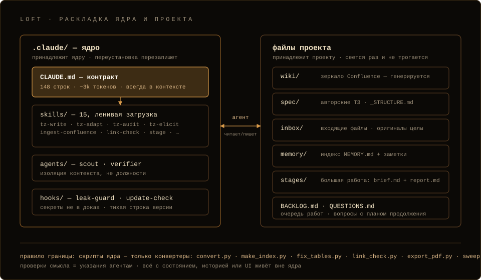
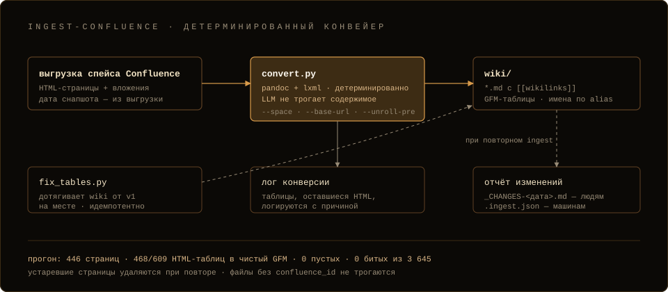

# Архитектура

В основе loft одна идея: файлы — единственная общая правда, а агент —
соавтор-аналитик. Всё остальное из неё следует.



## Контракт

[`.claude/CLAUDE.md`](../../bundle/.claude/CLAUDE.md) — 108 строк, ~3k
токенов, всегда в контексте и единственное, что в нём всегда. В нём три
вещи.

Профессия. Агент — системный/бизнес-аналитик на стороне владельца: пишет ТЗ
целиком и частями, аудирует чужие документы, поднимает структуру новых
проектов. Владельцу остаются развилки его уровня — деньги, скоуп, риски,
внешние неизвестные; формулировки, полнота, связность и обоснования — работа
агента. Технический вопрос, на который отвечают корпус и предметные знания,
агент закрывает сам: рекомендация, обоснование, способ проверить. Владелец
пришёл за помощью, а не за списком вопросов. Главное правило — ни одного
выдуманного факта: утверждение либо выводится из источника, либо названо
допущением в паспорте.

Читатель. Документ читает человек, который не открывал других файлов и будет
по нему действовать — следующий раздел.

Рабочие правила. Пять из них разворачиваются в разделы ниже: два уровня
работы, `verifier` на stage и сдаче, секреты, сабагенты, тесты. Остальные:
память перед нетривиальной работой и `remember` после неочевидного урока; ТЗ
и аудит — каждое своим скиллом; технический вопрос закрывается ответом, а не
вопросом; «прочитал» значит «файл открыт целиком»; после правки пачки
страниц гоняется `link-check`; сессия начинается с `QUESTIONS.md` и верха
`BACKLOG.md`. Остальное ядро — указатели.

## Для кого пишем

Раньше документ незаметно писался под приёмку — маркеры «решение от 12.08»,
пометки «(Допущение)», сноски «см. раздел 4». Всё это адресовано судье, а
читает документ человек, который не открывал других файлов и будет по нему
действовать. Чистовик пишется для него: связный текст, короткие правила по
схеме «вход → условие а: действие → условие б: действие», факт один раз и
ссылка вместо повтора, `[[wikilink]]` на самом термине вместо сноски «см.».
Перечисление с атрибутами — таблица, последовательность и состояния —
`mermaid`.

Служебное живёт в **паспорте документа** — frontmatter:

| Поле | Что в нём |
|---|---|
| `status` | draft / review / approved — за пределы корпуса уходит review или approved |
| `source` | запрос, из которого документ вырос |
| `based_on` | файлы, прочитанные целиком; из них выводятся утверждения |
| `assumptions` | что принято без подтверждения и что это подтвердит |
| `decisions` | ссылки на записи в `spec/решения.md` |
| `questions` | Q-N из `QUESTIONS.md` |

`verifier` сверяет с паспортом: покрывает ли `based_on` утверждения
документа, не спрятано ли допущение в тексте как факт. Следы служебного в
чистовике для него дефект, а не мелочь оформления.

Голос проекта задаёт секция «Голос» в `spec/_STRUCTURE.md` — абзацы-образцы
дословно, а не описание стиля; шаблоны формулировок и самопроверка на воду —
в `tz-elicit/templates.md`.

## Файлы

```text
wiki/         генерируемое зеркало Confluence — руками не правится;
              правки смысла — в Confluence или в spec/
spec/         авторские документы: ТЗ, глоссарий, решения.md, профиль
              _STRUCTURE.md (структура и голос), образцы-основы
              _reference/, решения по возвратам _reviews/
inbox/        только новое; отработанный оригинал — в inbox/done/
memory/       уроки · антипаттерны · паттерны · структурные профили,
              индекс MEMORY.md (строгие однострочники)
stages/       NNN-slug/brief.md + report.md — только большая работа
BACKLOG.md    единственная каноническая очередь: задачи и находки аудитов
QUESTIONS.md  открытые вопросы, каждый с планом продолжения после ответа
```

Незаписанное умирает вместе с контекстным окном, поэтому вывод, который
должен пережить сессию, ложится в файл сразу. `inbox/done/` — та же мысль:
что прочитано и встроено, видно по файловой системе, а не по памяти агента,
которой до следующей сессии не дожить.

Память — markdown-заметки плюс строгий однострочный индекс, поиск — чтение
индекса и grep. Авто-память Claude Code выключена в `settings.json`
(`autoMemoryEnabled: false`): две памяти расходятся молча, и потом не понять,
какая права. Что было, когда поиск шёл через демона, — в [почему
loft](why-loft.md).

`QUESTIONS.md` — парковка: критичный вопрос без ответа блокирует ТЗ, поэтому
он записывается с планом продолжения, а не тормозит работу молча. На старте
сессии отвеченные вопросы возвращают свои задачи в `BACKLOG.md`.

## Два уровня работы

| | Малое | Большое |
|---|---|---|
| **Что** | Одна страница, низкий риск | Полное ТЗ, аудит корпуса, реструктуризация, работа на несколько сессий |
| **Протокол** | Сделай, сверь, дальше | Скилл `stage` |
| **Артефакты** | Никаких | `stages/NNN-slug/brief.md` до, верифицированный `report.md` после |
| **Приёмка** | Автор сам | Вердикт `verifier` по критериям из брифа |

Другого процесса нет. Предшественник гонял один конвейер — журнал прогонов,
schema-валидация, многогейтовый verify — и на правку в одну строку, и на
полное ТЗ, платя за это контекстом.

## Скиллы

15 markdown-процедур в `.claude/skills/`, ленивая загрузка: скилл ничего не
стоит, пока им не пользуются. Здесь — по строке на каждый, процедура лежит
внутри скилла.

Работа с ТЗ:

- `tz-write` — написать ТЗ или раздел в структуре и голосе проекта.
- `tz-adapt` — снять профиль чужой структуры с образцов из
  `spec/_reference/`, положить в `memory/structures/` и писать в ней.
- `tz-elicit` — довести неполный запрос до брифа: банки вопросов по шести
  типам задач, шаблоны формулировок, самопроверка на воду.
- `tz-audit` — аудит по семи осям, таблица документ × ось со светофором,
  находки в `BACKLOG.md` со свидетельством `путь:строка`.
- `spec-bootstrap` — раскладка, профиль структуры, глоссарий и реестр решений
  нового проекта.

Работа с корпусом:

- `ingest-confluence` — детерминированный конвертер Confluence, ниже.
- `ingest-docs` — docx/pdf/картинки/html из `inbox/` в корпус: docx —
  pandoc'ом, pdf и картинки — конспектом со ссылкой на оригинал.
- `link-check` — `link_check.py`: битые `[[wikilinks]]`, `![[embeds]]`,
  относительные ссылки, ненайденные якоря, сироты. Резолюция как в
  Foam/Obsidian, при находках выход с кодом 1 — годится в пайплайн.
- `knowledge-map` — карта корпуса `wiki/_KNOWLEDGE-MAP.md`: строка на каждую
  страницу, синтез параллельными `scout`'ами. Страницы без строки в карте
  для `scout`'а не существует, поэтому карта покрывает корпус целиком.
- `review-intake` — возврат заказчика: docx с track changes (`pandoc
  --track-changes=all`, обычная конвертация правки молча теряет) → таблица
  принять/отклонить/вопрос в `spec/_reviews/`.

Процесс и сдача:

- `stage` — бриф с критериями готовности и премортемом до работы,
  верифицированный отчёт после.
- `remember` — урок, антипаттерн, паттерн или профиль в память проекта,
  с однострочником в индексе.
- `deliver-pdf` — `export_pdf.py` резолвит wikilinks и печёт PDF цепочкой
  движков (typst → weasyprint → wkhtmltopdf → Chrome headless →
  standalone-HTML); `--md` / `--bundle` собирают пакет `.md` для NotebookLM.
- `claude-docs` — публикация страницей claude.ai, только по прямой команде
  владельца (`disable-model-invocation`).
- `migrate-specos` — карантин машинерии предшественника с манифестом
  отката, см. [миграцию](migration.md).

## Конвертер Confluence

Конвертер — причина, по которой появилось правило границы.
`ingest-confluence` превращает HTML-выгрузку спейса в markdown-wiki с
`[[wikilinks]]` средствами pandoc + lxml. LLM не переписывает по дороге ни
одного факта — потому результат и можно проверить.



- Собственный писатель таблиц HTML→GFM. Таблица, не переживающая переезд,
  остаётся HTML и логируется с причиной — ничего не портится молча.
- Имена ссылок-вложений восстанавливаются из атрибута
  `data-linked-resource-default-alias`: ссылки читаются как имена файлов, а
  не `download.xhtml?...`.
- Повторный ingest обновляет снапшот. Устаревшие страницы удаляются, файлы
  без `confluence_id` во фронтматтере не трогаются — рукописные страницы
  внутри `wiki/` в безопасности. Удаление сразу многих страниц блокируется
  до явного `--allow-mass-removal`: обычно это признак неполной выгрузки, а
  не чистки в Confluence.
- Что изменилось, конвертер докладывает сам: `wiki/_CHANGES-<дата>.md` —
  людям, `wiki/.ingest.json` — машинам. Там же лежат флаги и версия
  конвертера, чтобы смена флагов не выглядела как правка сотен страниц.
- `fix_tables.py` — идемпотентный постпроцессор: дотягивает на месте wiki,
  сконвертированные v1.

Полевые цифры — 336 страниц реального банковского корпуса, 468 из 609 сырых
HTML-таблиц в чистом GFM, 0 битых ссылок из 3 645 — с разбором в [почему
loft](why-loft.md).

## Правило границы

То, что не даёт ядру отрасти обратно в предшественника:

- Скрипт в ядре — только детерминированный конвертер данных (вход → выход):
  `convert.py` (внутри `tablemd.py`, общий с `fix_tables.py`),
  `make_index.py`, `fix_tables.py`, `link_check.py`, `export_pdf.py`,
  `sweep.sh`. Список полный.
- Проверки смысла — терминология, полнота, санитария, трассировка, голос —
  это указания агентам в скиллах. Агент читает скилл и делает проверку сам,
  глазами и grep'ом.
- Функции с состоянием, историей и UI (git/дифф/версии, граф-экран, канбан)
  живут вне ядра. Никаких эмбеддингов, векторов, своего MCP, демонов и
  расписаний.

Векторный поиск заменяет связка «карта корпуса + чтение домена целиком»:
`knowledge-map` говорит, где лежит ответ, `scout` читает домен на Sonnet с
окном 1M и возвращает цитаты с путями. Чанк без контекста и оговорок в ТЗ
дороже лишнего чтения.

## Сабагенты

Два, и делятся они по изоляции контекста, а не по должностям:

- `scout` (`model: sonnet`, запись запрещена) читает корпус и внешние
  источники, чтобы этого не делало главное окно. Начинает с карты корпуса, а
  не с grep по тремстам страницам; названную страницу читает целиком, длинную
  — с `offset` до конца. Возвращает факты `путь:строка` и делит прочитанное
  на «Открыто целиком» и «Фрагментами»: на первый список опирается `based_on`
  в паспорте.
- `verifier` (`model: opus`) со свежим контекстом независимо судит документ —
  на stage и при сдаче наружу. Оси по порядку: читатель, критерии готовности
  из брифа, соответствие запросу, обоснованность через паспорт, целостность
  ссылок, структура, непротиворечивость. Выход — вердикт со счётом `N pass /
  M fail / K unverifiable`, таблица находок с severity и список «убрать».
  Ничего не чинит; кругов два, после второго работа сдаётся с оговорками.

## Хуки

Два:

- `leak-guard.sh` (`PreToolUse` на `Write|Edit|NotebookEdit`) блокирует
  запись, в новом тексте которой стоит значение из `.secrets.env` длиной от
  6 символов — в том числе JSON-экранированное, потому что payload хука
  приходит JSON'ом. Смотрит только на записываемый текст (`content`,
  `new_string`, `new_source`), поэтому правка, убирающая утёкший секрет,
  проходит: значение остаётся в `old_string`. В документах — `{{secret:KEY}}`
  или плейсхолдер `{ИМЯ_СИСТЕМЫ}`. Остальную гигиену — IP, хосты и учётки
  открытым текстом — держат агент и ось «гигиена» в `tz-audit`: хук не
  угадывает, что здесь внутренний адрес, а что пример из документации.
- `update-check.sh` (`SessionStart`) — одна строка, когда более новый loft
  лежит рядом с проектом (папка `loft/` или `$LOFT_HOME`) или вышел релизом
  на GitHub. На актуальной версии хук молчит, счастливый путь стоит ноль
  токенов, любой сбой — тихий выход. Кэш и отключение — в
  [установке](install.md).

## Тесты ядра

Ядро — это скрипты, а скрипты без прогонов гниют. `test/run.sh` — тонкий
каркас: счётчики, помощники сравнения и подключение кейсов. Сами кейсы лежат
в `test/cases/*.sh` по файлу на зону и подключаются в ту же оболочку, так что
временный каталог и счётчики у них общие. Более 500 ассертов, офлайн, на
одноразовых фикстурах (`test/fixtures/`, включая `edge` и `edge-b` под
крайние случаи разбора).

Зона целостности бандла читает то, что читает не человек, а харнесс Claude
Code: фронтматтер каждого скилла и агента, `settings.json` и пути хуков,
модель и запреты сабагентов, ссылки контракта на существующие скиллы. Ошибка
здесь ничего не роняет при прогоне — скилл просто молча не грузится, — и
потому она нужна тестом. Каждый кейс — либо реальный баг, пойманный руками,
либо свойство, обещанное документацией.

Набор — релизный гейт: `build-archive.sh` гоняет его первым и отказывается
собирать, если хоть что-то упало, а потом ставит собранный архив во
временный каталог по-настоящему. Сам инсталлер заканчивается самопроверкой
и, провалившись, откатывает установку — детали в [установке](install.md).

## Что принадлежит ядру, а что проекту

```text
.claude/     принадлежит ядру — переустановка перезаписывает. На месте
             не редактируется.
всё          принадлежит проекту — инсталлер сеет один раз там, где
остальное    отсутствует, и больше не трогает.
```

Исключения — то, что пишете вы сами внутри `.claude/`: свои скиллы и агенты,
`settings.local.json`, `commands/`, `rules/` и свои output-styles;
переустановка возвращает их из бэкапа на место.

Ядро правится в репозитории loft и доезжает до проектов переустановкой:
правка поставляемого файла внутри развёрнутого проекта умрёт при следующем
обновлении.
